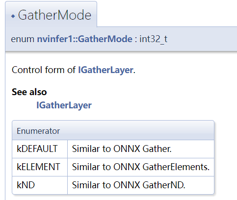

# faster-bert-as-service
Using TensorRT and Triton Server to build BERT model as a service

## 环境搭建
参考[Unified GPU Environment](https://github.com/xiangyangkan/gpu-learning/tree/main/docker)  
需要使用TensorRT, Triton Server和Tensorflow容器

> TIPS  
> - 查看TensorRT版本:   
  `nm -D /usr/lib/x86_64-linux-gnu/libnvinfer.so.8 | grep tensorrt_version`
> - 查看宿主机GPU环境版本:  
  `cat /usr/local/cuda/version.json`

## 编译
- 进入tensorrt容器  
`docker exec -it tensorrt bash`

- 编译动态链接库文件  
``cd /workspace/TensorRT && mkdir -p build && cd build && cmake .. -DTRT_LIB_DIR=$TRT_LIBPATH -DTRT_OUT_DIR=`pwd`/out && make -j$(nproc)``  
  `out`目录下的`libnvinfer_plugin*.so`就是在构建engine时需要用到的动态链接库文件  

- 将so文件放在项目的`faster-bert-as-service/dll/`目录下  
  以GTX1050显卡为例, 重命名为`libnvinfer_plugin_gtx1050.so`

## 构建BERT engine
以 [bert-base-chinese](https://huggingface.co/bert-base-chinese) 预训练模型的池化层输出为例：  

- 下载 [bert-base-chinese](https://storage.googleapis.com/bert_models/2018_11_03/chinese_L-12_H-768_A-12.zip) 模型，
  放在项目的`faster-bert-as-service/pretrain-models/bert-base-chinese`目录下 

- 导出engine  
``export GPU_MODEL=1050 PRETRAIN_DIR=`pwd`/pretrain-models/bert-base-chinese``    
`python3 builder.py -m $PRETRAIN_DIR/bert_model.ckpt -o engine_file/bert-base-chinese/1/model.plan 
 -s 16 -g -b 1 -b 2 --fp16 -w 1800 -c $PRETRAIN_DIR`

> **参数解释**     
> [GPU_MODEL](https://github.com/xiangyangkan/faster-bert-as-service/blob/main/builder.py#L37): 用于指定使用哪个.so文件, 不同卡的.so文件的有区别的  
> PRETRAIN_DIR: 预训练模型文件所在目录  
> -m: 指定ckpt文件位置  
> -o: 导出engine文件位置  
> -s: 最大序列长度  
> -g: 使用通用矩阵乘法实现FC2 layer  
> -b: batch_size大小, 可设置多组, 每个batch_size对应一个profile  
> --fp16: 使用半精度推理  
> -w: 构建时分配的显存大小, 在不爆显存的情况下越大越好  
> -c: bert config文件所在目录  

> **TIPS**  
> - 修改`TRT_LOGGER = trt.Logger(trt.Logger.VERBOSE)` 且使用重定向`python3 builder.py xxx 2>x.log`可以记录构建的详细日志(重定向前没有`2`不会写入VERBOSE信息)   
> - 详细信息中可以看到优化策略的搜索过程和算子融合的过程  
> - 算子融合的可视化可以使用[NVIDIA NSIGHT SYSTEM](https://developer.nvidia.com/nsight-systems)

## 启动Triton服务  
- 进入triton server容器    
`docker exec -it triton_server bash`

- 在项目当前目录下启动triton服务  
`tritonserver --model-store=./engine_file --strict-model-config=false --http-thread-count 32`

> 注意事项
> - 若显卡型号较旧, 指定`--min-supported-compute-capability x.x` 使triton支持  
>   [显卡计算等级查询](https://developer.nvidia.com/zh-cn/cuda-gpus)
> - 要查看具体启动错误信息, 指定`--strict-model-config=true`
> - 要打印详细日志, 指定`--log-verbose=1`, 但此时并发性能会受日志写入硬盘速度的限制而大幅降低
> - 自定义插件生效必须指定`LD_PRELOAD`, 否则默认使用`/usr/lib/x86_64-linux-gnu/libnvinfer_plugin.so`
> - 不同型号的卡导出engine时需要在相同的软硬件条件下重新编译对应的动态链接库，且导出engine时也需要在相应的硬件条件下(否则triton会报compute version错误)  

## TensorRT的算子API
- [IConvolutionLayer](https://docs.nvidia.com/deeplearning/tensorrt/developer-guide/index.html#convolution-layer) 卷积层算子    
  2D卷积对应NCHW张量, 四维以上的并入batch_size维度  
  3D卷积对应NCDHW张量, 五维以上的并入batch_size维度  

- [IEinsumLayer](https://docs.nvidia.com/deeplearning/tensorrt/developer-guide/index.html#einsum-layer) 爱因斯坦求和算子  
  参考numpy的[einsum函数](https://numpy.org/doc/stable/reference/generated/numpy.einsum.html)  

- [IFullyConnectedLayer](https://docs.nvidia.com/deeplearning/tensorrt/developer-guide/index.html#fullyconnected-layer) 全连接层算子  
  至少为3维张量, 最后三个维度会合并为一个维度, 剩余维度相当于都是batch_size维度进行广播。  
  输出张量会在最后补两个维度(1, 1)使输入和输出张量的shape保持一致
  

- [IGatherLayer](https://docs.nvidia.com/deeplearning/tensorrt/developer-guide/index.html#gather-layer)  切片提取算子  
  IGatherLayer的类型类似于[Onnx中的分类](https://github.com/onnx/onnx/blob/master/docs/Operators.md#gather)    
    
  
  - 默认gather模式 `rank(output) = (rank(input) - 1) + rank(index)`
  - `GatherElements Mode` 参考pytorch的[gather函数](https://pytorch.org/docs/stable/generated/torch.gather.html) , 
    `rank(input)=rank(index), shape(output)=shape(index)`
  - `GatherND Mode` `rank(output) = rank(input) + rank(index) - index_shape[-1] - (b+1)`
  
> **注意**
> - 默认gather模式需要指定`axis`和`num_elementwise_dims`, 这里的数值都取实际数字而不是bitmap数据。
> - `num_elementwise_dims`取值为0或1, 取值为0时就是onnx中的Gather算子，取值为1时类似`implicit batch`模式(隐藏batch_size维度)，
>   对于第一个维度默认为batch_size做广播, 广播方式类似于`GatherElements Mode`

> **例子**
> 假设`input_tensor`为`[4, 16, 768, 1, 1]`维度的张量, `indices_tensor`为`[3, 2]`维度的张量。  
> 若取axis=2, num_elementwise_dims=0, 输出张量的维度为`[4, 16, 3, 2, 1, 1]`
> 若取axis=2, num_elementwise_dims=1, 输出张量的维度为`[3, 16, 2, 1, 1]`

- [IMatrixMultiplyLayer](https://docs.nvidia.com/deeplearning/tensorrt/developer-guide/index.html#matrixmultiply-layer)  
  参考numpy的[matmul函数](https://numpy.org/doc/stable/reference/generated/numpy.matmul.html) ,
  除去最后两个维度剩余维度的shape要保持一致

- [IPoolingLayer](https://docs.nvidia.com/deeplearning/tensorrt/developer-guide/index.html#pooling-layer)  
  要求`rank(input) >= rank(kernel) + 1`, 对于2D-pooling最后两个维度看作H和W, 对于3D-pooling最后三个维度看作DHW

- [IRaggedSoftMaxLayer](https://docs.nvidia.com/deeplearning/tensorrt/developer-guide/index.html#raggedsoftmax-layer)  
  不同长度的序列的softmax  

- [IReduceLayer](https://docs.nvidia.com/deeplearning/tensorrt/developer-guide/index.html#reduce-layer)  
  Reduce操作包括`max, min, product, sum, and average`, 可选择保留输入张量的rank, 指定轴向使用bitmap

- [IResizeLayer](https://docs.nvidia.com/deeplearning/tensorrt/developer-guide/index.html#resize-layer)  
  参考ONNX的[resize算子](https://github.com/onnx/onnx/blob/master/docs/Operators.md#resize)

- [IRNNv2Layer](https://docs.nvidia.com/deeplearning/tensorrt/developer-guide/index.html#rnnv2-layer)  
  RNN算子支持LSTM和GRU

- [IShapeLayer](https://docs.nvidia.com/deeplearning/tensorrt/developer-guide/index.html#select-layer)  
  返回输入张量的shape(张量格式)

- [IShuffleLayer](https://docs.nvidia.com/deeplearning/tensorrt/developer-guide/index.html#shuffle-layer)  
  包含`transpose + reshape + second transpose`三个算子, 三个算子的默认值均不改变张量。 

- [ISliceLayer](https://docs.nvidia.com/deeplearning/tensorrt/developer-guide/index.html#slice-layer)  
  取张量的切片, 需要在每个维度设置起始点, 步进和切片长度

- [ISoftMaxLayer](https://docs.nvidia.com/deeplearning/tensorrt/developer-guide/index.html#softmax-layer)  
  Softmax算子, [指定轴向使用bitmap](https://docs.nvidia.com/deeplearning/tensorrt/api/c_api/classnvinfer1_1_1_i_soft_max_layer.html#a866ec69eb976e965b1c5c9f75ede189c)   

- [ITopKLayer](https://docs.nvidia.com/deeplearning/tensorrt/developer-guide/index.html#topk-layer)  
  取某个轴向的TopK数值, 指定轴向使用bitmap

## FAQ  
- **如何估计Triton的显存占用**    
总实例数 = 模型数 * 实例数  
内存占用= 总实例数 * 模型大小 * profile数量  

- **如何搜索最佳的max_batch_size**   
GPU利用率占满时, 说明算力短板占主导，应该增大MAX_BATCH_SIZE；  
GPU利用率偏低时, 说明队列等待延迟占主导，应该减小MAX_BATCH_SIZE。  
最佳配置就是在减少kernel调用次数和队列等待损失之间寻找一个最佳的平衡点。

  
- **如何编写自定义插件**    
https://github.com/NVIDIA/TensorRT/tree/master/samples/python/uff_custom_plugin  

- **[Triton配置文件](https://github.com/triton-inference-server/server/blob/main/docs/model_configuration.md)**  
  1. 存在max_batch_size时，会自动在最前面补一个-1维度，例如dims填[32, 4]会自动填充为[-1, 32, 4]
  2. reshape参数是为了应对dims为0维度，即只有batch size维度的情形，dims填写[ 1 ]并使用reshape: { shape: [ ] }
  3. shape tensors参数表示dims为shape tensors时，triton认定dims的第一维的值为batch size，将不进行自动填充；

- **如何设置算子的操作轴向**  
  对于Softmax, TopK, Reduce等算子在指定轴向时需要输入bitmap型数值，例如:  
  对`shape=[batch_size, sequence_length, hidden_size, 1, 1]`的张量在`hidden_size`维度做softmax,   
  指定`axis = 1<<2`，`1<<2`表示`bit2`

> **TIPS**  
> `bit x = power(2, x)`   
> `axis=0` 对应的就是`axis=1<<0`  
> `axis=1` 对应的就是`axis=1<<1`  

## 为什么快？
### FP16/INT8 推理
对于BERT finetune任务: 
- 训练阶段时建议使用混合精度训练，这样在推理时使用FP16模式对精度效果影响很小；
- 训练阶段时建议使用QAT训练，这样在推理时使用INT8模式对精度效果影响很小；

### 核融合
自定义的TensorRT的插件实现了Transformer网络的kernel fusion, 
除了gemm运算之外尽量进行算子融合，可以大幅减少kernel调用次数；

### 优化了Google BERT预处理模块处理速度
### 独创的二进制截断处理
如果模型的输出是一个长向量，此时的json在反序列化时的并发性能是很差的。  
因此可以强制使triton返回二进制格式的向量, 直接对json数据做固定字节数的截断进行强制解析，同时不影响剩余json部分的解析。 
如果输出的向量数据仍然太大，可以在下游添加残差网络进行降维。

## 参考资料  
- [TensorRT的数据格式](https://docs.nvidia.com/deeplearning/tensorrt/developer-guide/index.html#data-format-desc)  
- [Enabling Fusion](https://docs.nvidia.com/deeplearning/tensorrt/developer-guide/index.html#enable-fusion)
- [Layer API文档](https://docs.nvidia.com/deeplearning/tensorrt/developer-guide/index.html#layers)
- [运算强度和IO强度](https://www.coursehero.com/file/48346906/s9926-tensor-core-performance-the-ultimate-guidepdf/)
